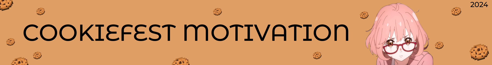

# cookiefest_motivation

Employee motivation system for the Novosibirsk hackathon Cookie Fest

## How to run (Linux\Windows)
`docker-compose up --build -d`

## How to stop (Linux\Windows)
`docker-compose dowm`

P.S
Если авторизация будет не работать, то переходите сразу по `/rating` или `/profile`

Ссылка на макет: [Figma](https://www.figma.com/design/cbXAI21YOHCk1c6HZ2myWo/%D0%A5%D0%B0%D0%BA%D0%B0%D1%82%D0%BE%D0%BD-%D0%9A%D1%83%D0%BA%D0%B8-%D1%84%D0%B5%D1%81%D1%82?node-id=0-1&t=QwmpDbkMrrawvEKM-1)
